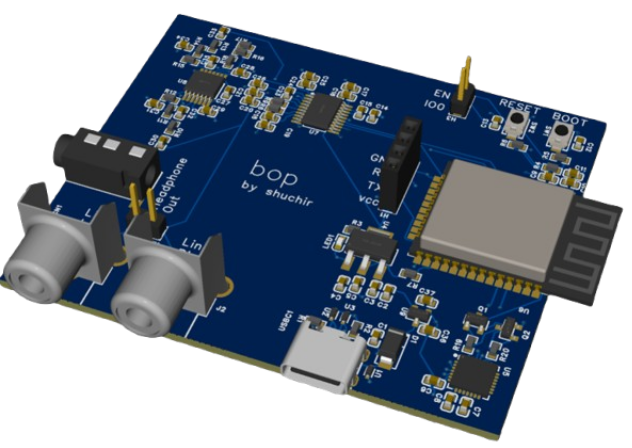

# bop
A bluetooth audio receiver to line level and headphone level out.

I made this because I have quite a few devices (speakers at my home, my car stereo, etc.) that don't have bluetooth functionality...but my phone doesn't have a headphone jack anymore either. So, I've built a bluetooth receiver my phone can connect to. The receiver routes audio through a dedicated DAC for better sound quality and provides access to unfiltered line level out for stereo systems.

A [bill of materials](src/PCB/BOM.xlsx) is available as well.