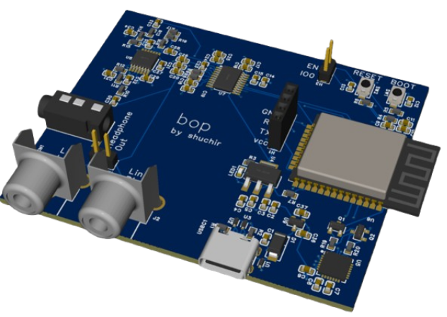

# bop
A bluetooth audio receiver to line level and headphone level out.

I made this because I have quite a few devices (speakers at my home, my car stereo, etc.) that don't have bluetooth functionality...but my phone doesn't have a headphone jack anymore either. So, I've built a bluetooth receiver my phone can connect to. The receiver routes audio through a dedicated DAC for better sound quality and provides access to unfiltered line level out for stereo systems.

A [bill of materials](src/PCB/BOM.xlsx) is available as well.

## Setup
1. Install the CP201x USB to UART Bridge VCP Drivers from [Silicon Labs](https://www.silabs.com/developers/usb-to-uart-bridge-vcp-drivers).
2. Install Arduino IDE from [arduino.cc](https://www.arduino.cc/en/software).
3. Install the following in Arduino IDE:
   - esp32 board support via the board manager
4. Install the [arduino audio tools](https://github.com/pschatzmann/arduino-audio-tools) and [ESP32-A2DP](https://github.com/pschatzmann/ESP32-A2DP) libraries via the library manager.
5. Connect bop to your computer via USB.
6. Via device manager, click "Select other board and port" and select the COM port for the CP2102 USB to UART Bridge.
    a. Set the board as "ESP32 Dev Module".
    b. Set the partition scheme to "Huge APP (3MB No OTA/1MB SPIFFS)".
7. Open `src/firmware/bop.ino` in Arduino IDE and flash it to the board.
8. Connect to bop via bluetooth and play some music!